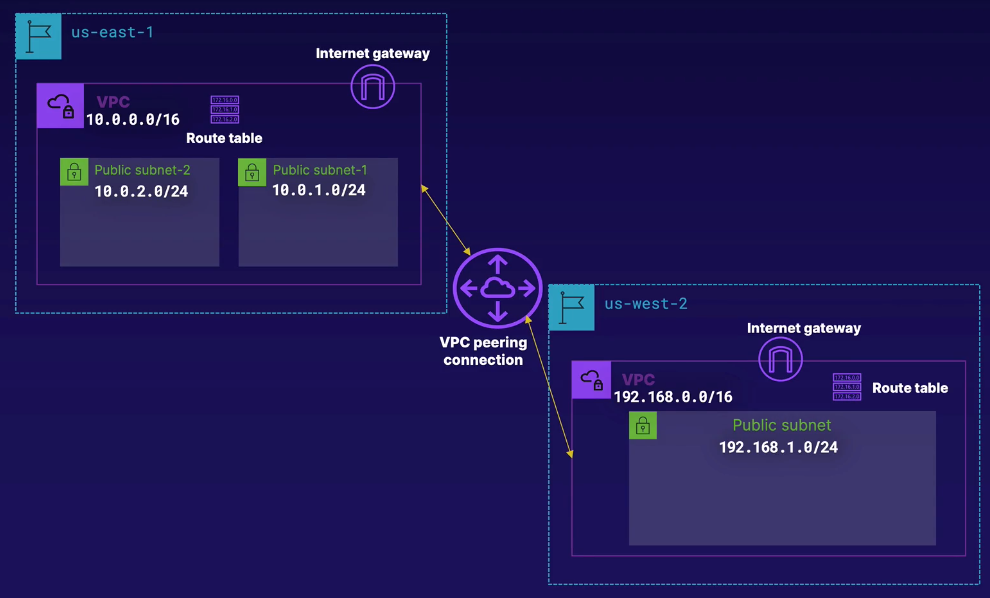

https://learn.acloud.guru/handson/5e246e14-d5bf-4515-bddc-b93df1d345b7



# Additional Resources
You work for Pinehead Terraformers, a company which specializes in deploying networking layouts on AWS using Terraform. You're a Solutions Architect on part of a project for a start-up whereby you need to deploy a multi-region network for the start-up. The requirement is that the customer (start-up) wants to deploy EC2 instances in more than one region and wants EC2 instances in different VPCs to be able to communicate securely. The customer has no idea how to do this via AWS and so have left it up to you to show them a sample layout.

You already have a plan in mind. You're thinking along the following lines:

Deploy a VPC each in us-east-1 and us-west-2. (This is a requirement too)  
The us-east-1 VPC will have CIDR range of `10.0.0.0/16`.  
The us-west-2 VPC will have CIDR range of `192.168.0.0/16`.  
There will be two subnets in the us-east-1 VPC with the following CIDR ranges: `10.0.1.0/24` and `10.0.2.0/24`.  
There will be one subnet in the us-west-2 VPC with the following CIDR range: `192.168.1.0/24`.  
You'll deploy a VPC peering connection between both VPCs. (You'll initiate the peering connection from us-east-1).  
You'll be creating/modifying VPC route tables accordingly so that traffic can flow between the two VPCs.  
Create and attach internet gateways to both VPCs.  
Create security groups which allow incoming traffic on TCP ports 22 and 8080. You'll also need to ensure security groups in each region allow traffic on all ports from the IP range of the peered VPC or at least its subnets.  
Good luck!


# Code for this lab:
```
git clone https://github.com/linuxacademy/content-deploying-to-aws-ansible-terraform.git

cd content-deploying-to-aws-ansible-terraform/lab_network_vpc_peering
```